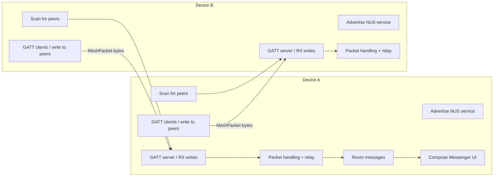
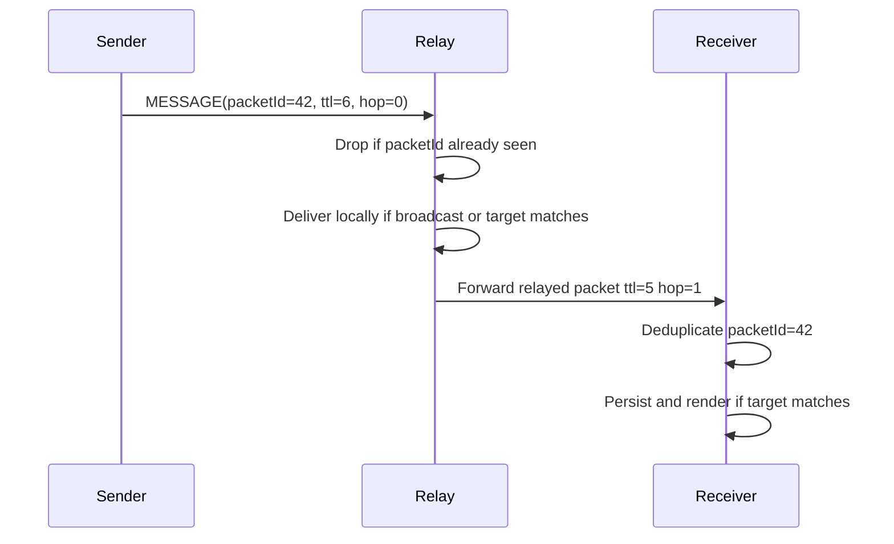
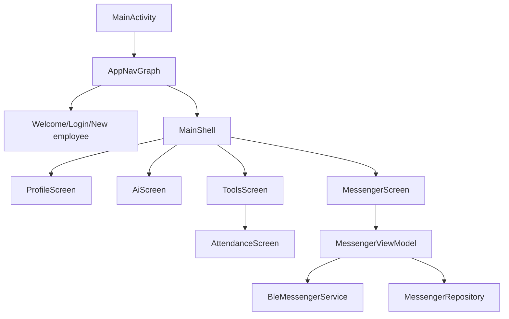

# Art Leader MVP (Android)

Art Leader MVP is a Kotlin/Jetpack Compose Android prototype for an internal RPK Art Leader workplace app. It combines local authentication, profile and tools screens, an OpenAI-compatible AI assistant, NFC attendance tracking, and a real BLE mesh messenger that runs without a backend server.

## Current feature set

- **Authentication and session**: local Room-backed demo users, DataStore session persistence, logout/session reset, and biometric-ready UX flags.
- **Compose shell**: bottom navigation for Profile, AI, Tools, and Messenger.
- **BLE mesh messenger**: foreground BLE service with advertising, scanning, GATT server/client roles, packet relay, TTL forwarding, deduplication, peer discovery, broadcast messaging, and private peer messaging.
- **Room persistence**: conversations, messages, peers, users, and attendance events are stored locally and observed through Kotlin `Flow`.
- **AI assistant**: configurable OpenAI-compatible chat UI with provider presets for OpenAI, Claude, Gemini, Ollama, and custom endpoints.
- **NFC attendance**: enter/exit event history with NFC feature detection and a simulation mode on devices without NFC.

## BLE mesh messenger architecture

The messenger is centered on `BleMessengerService`, a foreground service inspired by BLE mesh messenger designs. Each device acts as both a BLE peripheral and a BLE central:



### Advertising and scanning

- The service advertises the Nordic UART Service UUID so nearby app instances can discover it.
- The same service also scans for that UUID and connects to discovered devices.
- RSSI from scan results is tracked by BLE address and attached to peer records when the remote peer later sends an `ANNOUNCE` packet.

### GATT central and peripheral roles

- **Peripheral role**: the device hosts a GATT server with RX/TX characteristics. Remote centrals write serialized mesh packets into RX.
- **Central role**: the device connects to remote peripherals, discovers the RX characteristic, and writes mesh packets with no-response writes for low-latency best-effort delivery.
- A successful GATT discovery triggers an `ANNOUNCE` packet so the peer registry learns the sender id and display name.

### Mesh packet routing

Packets are represented by `MeshPacket` and serialized to UTF-8 JSON bytes. The current packet types are:

| Type | Purpose |
| --- | --- |
| `ANNOUNCE` | Peer discovery and display-name exchange. |
| `MESSAGE` | User text payload for broadcast/private chat. |
| `PING` | Lightweight liveness request. |
| `PONG` | Lightweight liveness response. |
| `HELLO` / `ACK` | Compatibility packet types retained for existing mesh callers. |

A packet contains a `senderId`, `targetId`, `packetId`, `timestamp`, `ttl`, `hopCount`, and payload. `MeshPacket.BROADCAST_TARGET` marks broadcast packets. Any other `targetId` is treated as private routing toward that peer.

### Relay system, TTL forwarding, and deduplication



- Each service keeps a bounded `PacketDeduplicator` so repeated relays or echo packets are ignored.
- If a packet is not addressed only to the local peer and still has TTL budget, it is forwarded using `relayed()`, which decrements `ttl` and increments `hopCount`.
- The prune timer periodically marks stale peers offline, prunes dedup entries, and re-announces the local device while connected.

### Peer discovery

`PeerRegistry` stores `NearbyPeer` records with numeric peer id, hex id, display name, RSSI, online status, and last-seen timestamp. The registry publishes a `StateFlow<List<NearbyPeer>>`, sorted with online/recent peers first, which the Compose messenger screen renders as nearby peer bubbles.

### Broadcast and private messaging

- The ViewModel sends through the bound `BleMessengerService`.
- Private chat ids are deterministic: `private_<lowerPeerId>_<higherPeerId>`.
- The ViewModel extracts the other participant from the private chat id and passes it as `targetPeerId`; non-private conversations fall back to `MeshPacket.BROADCAST_TARGET`.
- Outgoing and incoming messages use deterministic `packet_<packetId>` Room message ids so mesh duplicates replace instead of multiplying local rows.

## Room persistence

Room is the local source of truth for persisted app data:

- `ConversationEntity`: chat title, type, participants, last message, unread metadata.
- `MessageEntity`: sender, target, payload text, packet id, hop count, TTL, delivery state, and timestamp.
- `PeerEntity`: stored peer metadata for repository compatibility.
- `AttendanceEventEntity`: NFC/simulated enter and exit events.
- `UserEntity`: demo user records for local authentication.

Repositories wrap DAOs and expose `Flow` streams to ViewModels. Compose screens collect those streams with lifecycle-aware state APIs.

## Compose UI structure



- `MainActivity` builds Room, repositories, and ViewModels.
- `AppNavGraph` controls authenticated vs unauthenticated routes.
- `MainShell` hosts bottom navigation tabs.
- `MessengerScreen` binds/unbinds the BLE mesh foreground service based on the screen lifecycle and permission state.

## AI integration

The AI screen is a local Compose client for OpenAI-compatible HTTP APIs:

- Provider presets: OpenAI, Claude, Gemini, Ollama, and Custom.
- Editable base URL, model, API key, system prompt, and temperature.
- Connection test calls the provider `/models` endpoint.
- Chat completion sends a non-streaming `/chat/completions` request on a background thread and appends the response to the Compose message list.

API keys are entered in the UI for the current session; do not hard-code production credentials in the repository.

## NFC attendance system

The Tools tab exposes Attendance / NFC:

- Detects whether the device reports NFC support.
- Records simulated or scanned tag events through `AttendanceViewModel` and `AttendanceRepository`.
- Persists `ENTER` and `EXIT` rows in Room.
- Shows current shift state, approximate session duration, and a chronological event history.

## Build and run

1. Open the project in Android Studio.
2. Sync Gradle with JDK 17.
3. Run the `app` configuration on an Android 8.0+ device.
4. Grant nearby/Bluetooth permissions from the Messenger screen when prompted.

CLI check used by maintainers:

```bash
JAVA_HOME=/path/to/jdk17 gradle :app:compileDebugKotlin
```

See [`docs/ARCHITECTURE.md`](docs/ARCHITECTURE.md) for a deeper implementation map.
