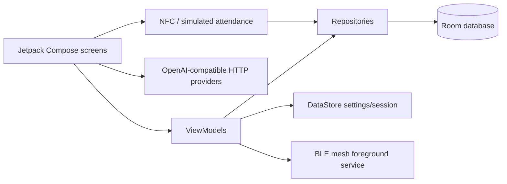
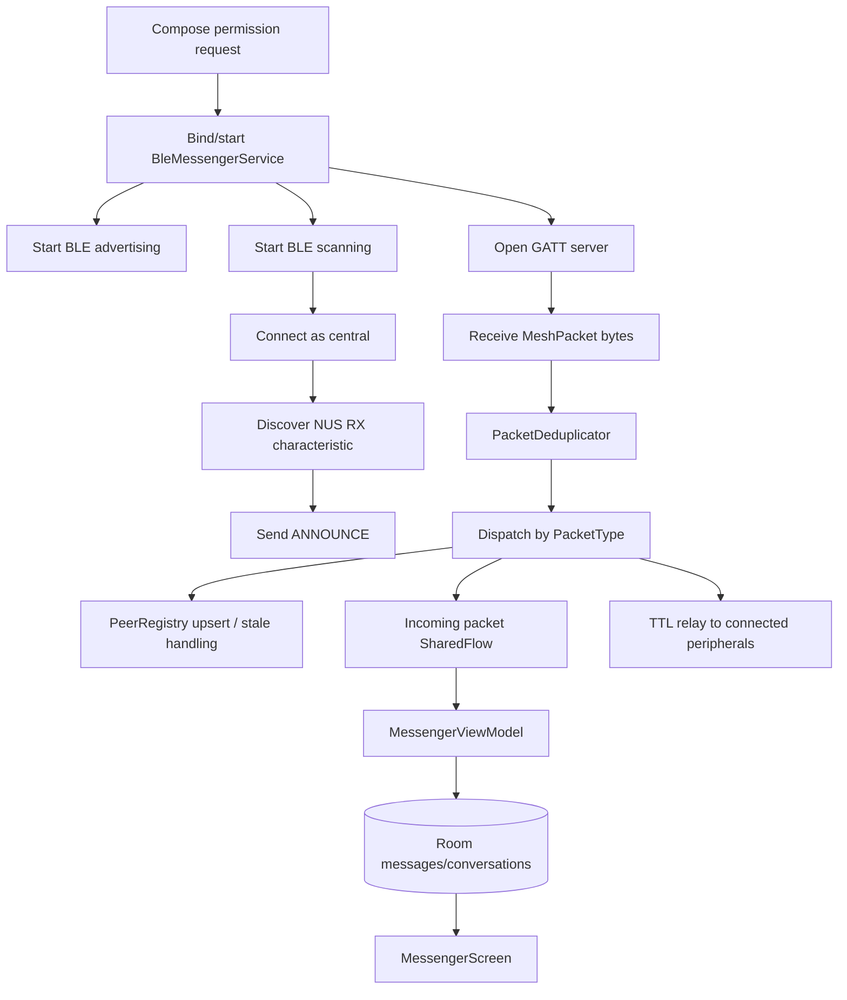
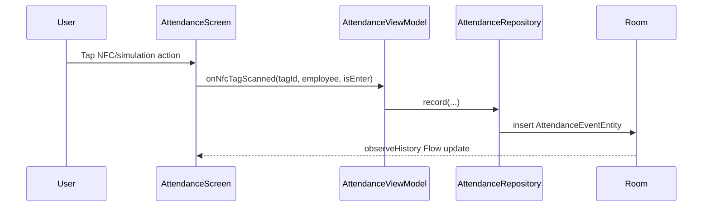

# Art Leader MVP architecture overview

This document describes the current implementation. It is intentionally aligned with the source tree and the BLE mesh messenger currently used by the Compose UI.

## High-level modules

## App startup and navigation

- `MainActivity` creates the Room database, repositories, and main ViewModels.
- `MainViewModel` manages authenticated session state and settings via repositories/DataStore.
- `AppNavGraph` chooses the unauthenticated welcome/login flow or the authenticated `MainShell`.
- `MainShell` exposes Profile, AI, Tools, and Messenger tabs.

## BLE mesh subsystem

### Components

| Component | Responsibility |
| --- | --- |
| `BleMessengerService` | Foreground BLE transport, GATT server/client lifecycle, packet handling, relay, peer pruning. |
| `MeshPacket` | Wire packet model and JSON-byte serialization. |
| `PacketType` | Mesh packet purpose enum: announce, message, ping, pong, plus compatibility values. |
| `PacketDeduplicator` | Bounded packet-id memory to suppress repeated relay/echo packets. |
| `PeerRegistry` | Online peer cache exposed as `StateFlow`. |
| `NearbyPeer` | UI-facing nearby peer identity, display name, RSSI, and online status. |
| `MeshRouter` | Pure routing helper for local delivery plus TTL relay decisions. |
| `MessengerViewModel` | Bridges Compose, Room, and the BLE foreground service. |
| `MessengerRepository` | Room persistence wrapper for conversations and messages. |

### Transport flow

### Packet routing rules

1. Decode incoming bytes with `MeshPacket.fromBytes()`.
2. Drop the packet if the packet id was already seen.
3. Handle discovery/control packets:
   - `ANNOUNCE`: update `PeerRegistry` with peer id, display name, RSSI, and last-seen time.
   - `PING`: write a `PONG` back to the sender address.
   - `PONG`: refresh the peer last-seen time when known.
4. Handle `MESSAGE` packets by emitting them only when they are broadcast, addressed to the local peer, or locally originated.
5. Relay packets not addressed only to the local peer when `ttl > 0` and `hopCount` remains under the default mesh limit.
6. Use `MeshPacket.relayed()` for forwarding so TTL decreases and hop count increases deterministically.

### Persistence mapping

`MessengerViewModel` maps mesh packets into Room rows:

- Incoming remote packet: `messageId = "packet_<packetId>"`, `deliveryState = "delivered"`, `isMine = false`.
- Outgoing local packet: sent via `BleMessengerService.sendMessage()`, then persisted with the service-assigned `packetId`, `deliveryState = "sent"`, and `isMine = true`.
- Deterministic message ids keep Room rows stable if a packet is re-observed after a restart or relay path change.

## AI assistant

`AiScreen` implements provider configuration and OpenAI-compatible chat calls directly in the UI layer:

- The provider enum supplies default base URLs and model names.
- The connection test sends `GET <baseUrl>/models` with bearer authorization.
- Chat sends `POST <baseUrl>/chat/completions` with `stream=false` and a system message plus conversation history.
- Responses are parsed for `choices[0].message.content` and appended to the Compose message list.

This implementation is intentionally client-configurable for demos; production hardening should move secrets and network work behind a repository/service layer.

## NFC attendance

- Devices without NFC show simulation controls.
- Each scan/tap records `ENTER` or `EXIT` with tag id, employee login, and timestamp.
- The UI derives current shift state and session duration from the stored event history.

## Documentation maintenance checklist

When the implementation changes, update this document and `README.md` for:

- BLE packet fields, packet types, relay rules, or deduplication behavior.
- Room entity shape or message persistence semantics.
- Compose navigation structure or new tabs/screens.
- AI provider/network behavior.
- NFC attendance behavior or persistence.
